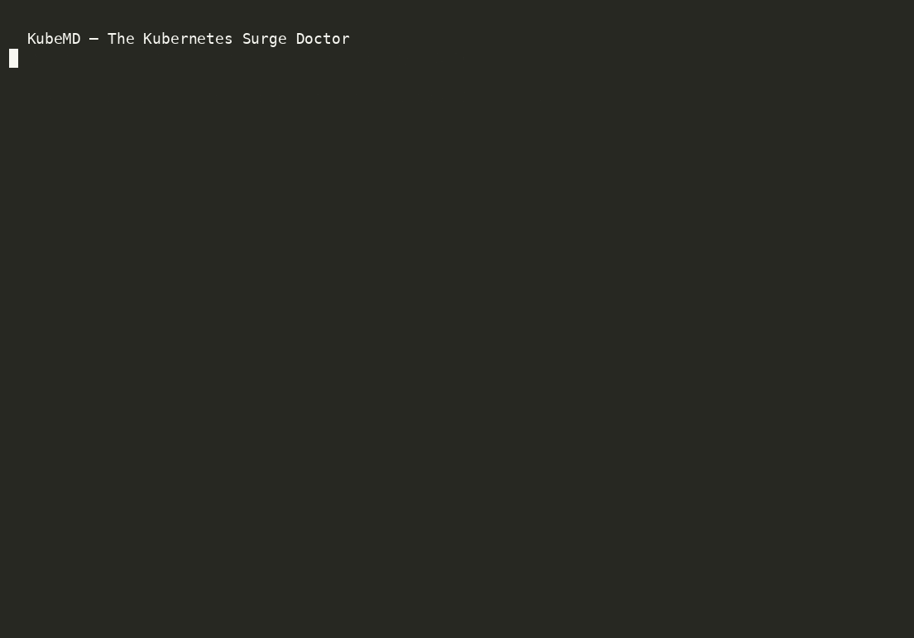

# KubeMD — The Kubernetes Surge Doctor

**Evidence-first runtime diagnosis for Kubernetes failures — with case memory.**

A DSH (DeepSeek Harness) skill that diagnoses **live, broken clusters**, not manifests. When a pod is CrashLooping, a node goes NotReady, or a Service stops answering, KubeMD runs a disciplined loop: capture context → build a red-capable feedback loop → collect signals → rank falsifiable hypotheses → fix with dry-run semantics → **record the case for instant recall next time**.

> Different from KubeShark-style skills: they prevent hallucinations *while writing YAML*. KubeMD finds out *why your running workload is broken* — and never forgets a fix.

[](https://github.com/deepseek-ai/deepseek-harness)
[](LICENSE)
[](https://github.com/Dominic789654/awesome-deepseek-harness)
[](https://github.com/Zhiyuan-Fan/Awesome-DeepSeek-Harness-Plugins)
[](https://github.com/0xsline/awesome-deepseek-harness)
[](https://dshbase.com/plugins/kubemd/)

## Install (30 seconds)

```bash
git clone https://github.com/guiyi-labs/kubemd ~/.dsh/skills/dsh-k8s-diagnosis
```

That's it. DSH auto-discovers skills in `~/.dsh/skills/`. No restart needed.

> DSH (DeepSeek Harness) — everything is a plugin. Skills are instruction bundles + scripts that agents load on demand.

> 💡 **Install as a skill directory:** the repo layout we ship is exactly a DSH skill bundle. Or copy the folder and rename to `dsh-k8s-diagnosis` under `~/.dsh/skills/`.

## Demo

CLI running against a real fault-injected kind cluster (diagnose → 4 findings → case recall):



Reproduce it yourself in ~60s (needs Docker, kind, and the aiops CLI — or just the skill):

```bash
# 1) a real broken cluster
kind create cluster --name kubemd-demo
kubectl run crash-app --image=nginx:1.25 --command -- sleep 10   # crashes on purpose
kubectl rollout status deployment/crash-app 2>/dev/null || true

# 2) diagnose it (CLI twin of the skill, same deterministic engine)
go install github.com/guiyi-labs/aiops-platform/cmd/aiops@latest
aiops diagnose --namespace default --pod crash-app --period 5   # signals → root cause

# 3) recall the case next time
aiops cases --query crash-loop
```

Same loop the skill runs: signals first, hypotheses ranked, fix suggested dry-run.


## What it does

```
Symptom: "pod CrashLoopBackOff after image update to :latest"
   │
   ├─ Phase 1  capture context      (cluster, scope, recent changes)
   ├─ Phase 2  build feedback loop  (kubectl events/logs → 10s red-capable signal)
   ├─ Phase 3  collect signals      (events → status → --previous logs → node)
   ├─ Phase 4  rank 3-5 falsifiable hypotheses  (predictions, not vibes)
   ├─ Phase 5  verify, dry-run      (kubectl diff / rollout undo)
   ├─ Phase 6  record the case      (cases.yaml → recall next time)
   └─ Phase 7  output contract      (ROOT_CAUSE / EVIDENCE / FIX / CASE_RECORDED)
```

## Included

| Path | Purpose |
|---|---|
| `SKILL.md` | The 7-phase procedure (short, token-efficient) |
| `references/signal-map.md` | Symptom → signal → command cheatsheet |
| `references/playbooks/` | Deep playbooks: crashloop, oom, network, pending, node-not-ready |
| `scripts/collect-signals.sh` | One-shot signal collection for Phase 3 |
| `scripts/record-case.sh` | Append a resolved diagnosis to `cases.yaml` |
| `cases.yaml` | Your growing case library (starts with examples; grows with your fleet) |

## Case memory (the differentiator)

Every resolved diagnosis becomes a record. Next time the same symptom appears, search first:

```bash
grep -i "crashloop" ~/.dsh/skills/dsh-k8s-diagnosis/cases.yaml
```

A recalled past case is the fastest diagnosis: reproduction loop + remembered fix + re-verify. This is a local MVP of a broader AIOps knowledge loop — the same "distill resolved diagnoses into a searchable library" idea that powers LLM-assisted root-cause analysis at platform scale.

## Also: the aiops CLI

Prefer a terminal? The same deterministic diagnosis rules ship as a `go install`-able CLI:

```bash
go install github.com/guiyi-labs/aiops-platform/cmd/aiops@latest
aiops diagnose --namespace demo --pod web-0     # rule-based root cause
aiops cases --query "crashloop"                 # historical case recall
```

No server. No database. One binary. Same engine, two doors: KubeMD (agent guidance) ↔ aiops CLI (terminal automation).

## Design principles (borrowed from the best)

- **Feedback loop first** (mattpocock/diagnosing-bugs): no hypothesis before a red-capable loop exists
- **Token-efficient progressive disclosure** (KubeShark): SKILL.md stays short; playbooks load on demand
- **Truthfulness**: every step marks verified vs unverified; never claim what you didn't run
- **Dry-run semantics**: `kubectl diff` before apply, `rollout undo` over live edits

## Roadmap

- [x] SKILL.md + signal-map + 5 playbooks + scripts
- [x] cases.yaml examples + LICENSE + branding
- [ ] Verified against kind cluster (real fault injection: crashloop / oom / netpol deny)
- [ ] MCP tooling for DSH diagnosis hints
- [ ] Sync cases.yaml ↔ aiops-platform knowledge base (RAG)

## License

Apache-2.0